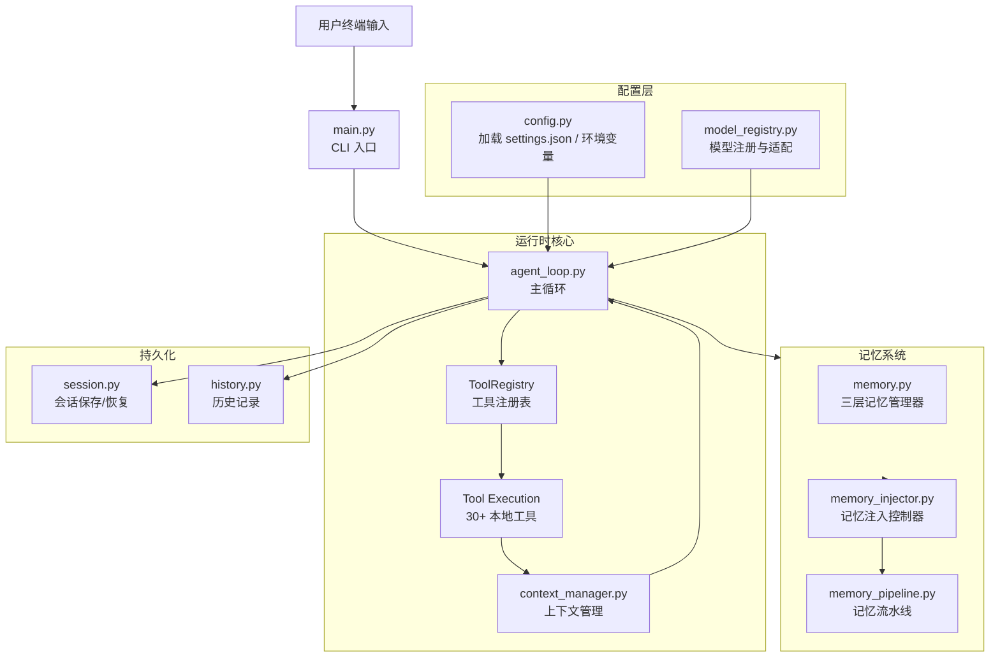
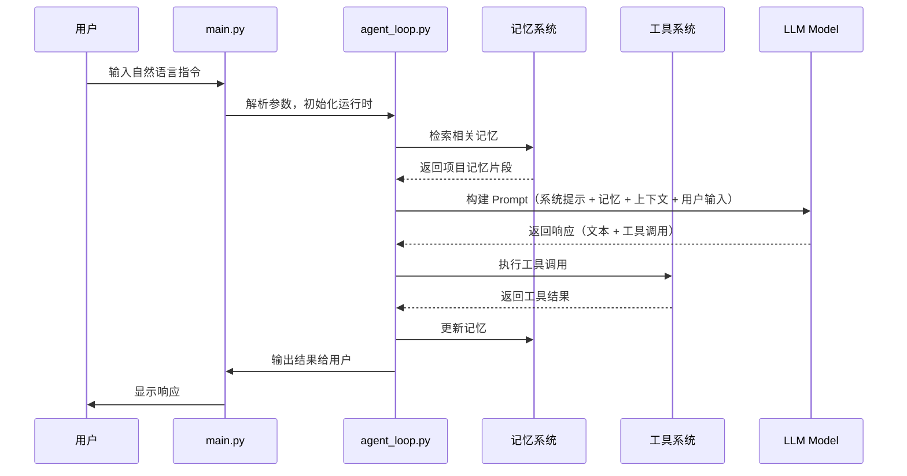

# Mini-Coding

<p align="center">
  <strong>一个运行在终端中的本地编码 AI Agent。</strong>
</p>

<p align="center">
  
  
</p>

Mini-Coding是一个运行在终端中的编码助手 Agent。它能自动管理上下文窗口、记忆检索、成本追踪和故障恢复，让你在本地开发中专注于编码本身。

---

## 目录

- [项目介绍](#项目介绍)
- [数据流](#数据流)
- [模块架构](#模块架构)
- [使用流程](#使用流程)
- [快速开始](#快速开始)

---

## 项目介绍

### 它能做什么

- 在终端中通过自然语言对话，完成代码编写、文件编辑、命令执行、代码搜索等任务
- 跨会话记忆能力：记住项目约定、架构决策和代码模式
- 自动管理上下文窗口，避免 Token 溢出
- 运行时故障检测与恢复
- 支持 MCP（Model Context Protocol）服务器扩展
- 支持多模型后端（Anthropic、OpenAI、OpenRouter 等）

### 与传统 Coding Agent 的区别

| 方面 | 传统 Agent | MiniCode Python |
|---|---|---|
| 上下文管理 | 手动或被动截断 | 自动压缩与预算管理 |
| 记忆系统 | 无记忆或简单注入 | 三层记忆 + TF-IDF 检索 |
| 错误处理 | 简单重试 | 故障检测与恢复 |
| 成本控制 | 无 | Token 计量与限制 |
| 工具调度 | 按需调用 | 统一注册与执行 |

---

## 数据流

### 整体架构



### 单次交互的数据流



---

## 模块架构

### 核心目录结构

```
minicode/
├── agent_loop.py          # 主循环 — 编排整个 Agent 的生命周期
├── main.py                # CLI 入口 — 参数解析、初始化、启动
├── config.py              # 配置加载 — settings.json / 环境变量
│
├── memory.py               # 三层记忆管理器
├── memory_injector.py      # 记忆注入控制器
├── memory_pipeline.py      # 记忆流水线（curation + 维护）
│
├── context_manager.py      # 上下文窗口管理
├── context_compactor.py    # 上下文压缩
│
├── tooling.py              # 工具框架（ToolContext / ToolRegistry）
├── tools/                  # 30+ 内置工具
│   ├── read_file.py        # 文件读取
│   ├── edit_file.py        # 文件编辑
│   ├── grep_files.py       # 代码搜索
│   ├── run_command.py      # 命令执行
│   ├── web_search.py       # 网页搜索
│   ├── web_fetch.py        # 网页抓取
│   ├── write_file.py       # 文件写入
│   ├── task.py             # 子任务调度
│   └── ...
│
├── session.py              # 会话保存与恢复
├── history.py              # 历史记录
├── prompt.py               # System Prompt 构建
│
├── cli_commands.py         # 斜杠命令（/help, /tools, /cost 等）
├── tty_app.py              # TTY 应用层
│
├── tui/                    # 终端 UI 组件
│   ├── chrome.py           # 界面框架
│   ├── screen.py           # 屏幕管理
│   ├── input.py            # 输入处理
│   └── transcript.py       # 对话转录
│
└── types.py                # 公共类型定义
```

### 关键模块详解

#### 1. 记忆系统（Memory System）

三层记忆架构，支持跨会话的知识保留：

```
User 记忆 (~/.mini-code/memory/)
  └── 跨项目、全局持久化
Project 记忆 (.mini-code-memory/)
  └── 项目级别、可版本控制
Local 记忆 (.mini-code-memory-local/)
  └── 本地开发、不入库
```

- 使用 TF-IDF 算法进行相关度检索
- 可选 LLM Rerank 提升检索精度
- 自动注入 System Prompt
- 后台定期维护（压缩、去重、过期清理）

#### 2. 上下文管理（Context Management）

- Token 实时估算与监控
- 动态压缩触发
- 智能截断策略（保留头尾 + 关键信息）
- 预算调整

#### 3. 工具系统（Tool System）

30+ 内置工具，涵盖开发日常所需：

| 类别 | 工具 |
|---|---|
| 文件操作 | read_file, write_file, edit_file, modify_file, patch_file |
| 搜索 | grep_files, list_files, file_tree, code_nav |
| 命令 | run_command, test_runner |
| 代码质量 | code_review, diff_viewer |
| 网络 | web_search, web_fetch, http_utils |
| 数据处理 | json_utils, csv_utils, regex_utils, text_utils, encoding_utils |
| 协作 | ask_user, load_skill, todo_write |
| 调度 | task（子 Agent 调度）|
| 实用工具 | archive_utils, batch_ops, crypto_utils, git |

---

## 使用流程

### 1. 安装

```bash
git clone https://github.com/Au-LiuJY/mini-coding.git
cd mini-coding
pip install -e .[dev]
```

### 2. 配置

```bash
# 方式一：环境变量
export ANTHROPIC_API_KEY=sk-ant-...
export ANTHROPIC_MODEL=claude-sonnet-4-20250514

# 方式二：配置文件
# 编辑 ~/.mini-code/settings.json
{
  "model": "claude-sonnet-4-20250514",
  "env": {
    "ANTHROPIC_API_KEY": "sk-ant-..."
  }
}
```

### 3. 启动

```bash
minicode-py
```

### 4. 日常使用

启动后进入交互式终端，可直接输入自然语言：

```
╔══════════════════════════════════════════════════════════╗
║  🤖 MiniCode Python - Your Terminal Coding Assistant    ║
╠══════════════════════════════════════════════════════════╣
║  Model: claude-sonnet-4-20250514                        ║
╚══════════════════════════════════════════════════════════╝

💡 Quick Start Guide:
  📝 Edit files:     edit_file.py or patch_file.py
  🔍 Search code:    /grep <pattern> or grep_files tool
  🏃 Run commands:   /cmd <command> or run_command tool

🚀 Try saying:
  "帮我分析这个项目的结构"
  "用 TDD 方式实现 XX 功能"
  "系统性地调试这个 bug"

You >
```

### 5. 斜杠命令

| 命令 | 说明 |
|---|---|
| `/help` | 查看所有可用命令 |
| `/tools` | 列出可用工具 |
| `/cost` | 查看 API 消耗 |
| `/context` | 查看上下文窗口使用情况 |
| `/memory` | 查看记忆系统状态 |
| `/model <name>` | 切换模型 |
| `/session` | 会话管理 |
| `/skills` | 查看已发现的 Skill |
| `/mcp` | 查看 MCP 服务器状态 |
| `/exit` | 退出 |

### 6. 会话管理

- 自动保存：每 30 秒增量保存会话
- 恢复会话：`minicode-py --resume latest`
- 列出会话：`minicode-py --list-sessions`

---

## 快速开始（一键体验）

```bash
# 安装
git clone https://github.com/Au-LiuJY/mini-coding.git
cd mini-coding
pip install -e .[dev]

# 配置 API Key
export ANTHROPIC_API_KEY=sk-ant-...
export ANTHROPIC_MODEL=claude-sonnet-4-20250514

# 启动
minicode-py
```
